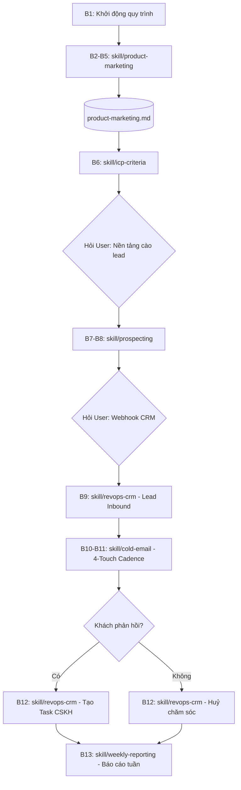

# MASTER WORKFLOW — TOÀN BỘ TIẾN TRÌNH VẬN HÀNH 13 BƯỚC

**Kết nối CRM:** các bước B9/B12 dùng `TINACRM_CONNECTION.md` làm quy tắc ưu tiên. Thử native MCP sẵn có; không mặc định yêu cầu webhook nhập lead/task và không yêu cầu workspace ID riêng cho REST/MCP. Các payload, mẫu hỏi webhook bên dưới chỉ dành cho trường hợp workflow custom đã được thiết lập.

Tài liệu này mô tả chi tiết logic chuyển trạng thái, đầu vào, đầu ra và kịch bản hỏi người dùng cho từng bước trong quy trình.

**Kiến trúc ưu tiên:** [LOCAL_EXECUTION.md](LOCAL_EXECUTION.md) và [BUSINESS_ONBOARDING.md](BUSINESS_ONBOARDING.md). Claude Desktop điều phối với công cụ cục bộ; TinaCRM lưu lead và trạng thái theo workspace của doanh nghiệp. Mục tiêu lead/ngày, số email, lịch và người nhận báo cáo lấy từ `config/business.json` do Claude thiết lập với người dùng. Các ví dụ 4 email bên dưới chỉ là tham khảo. Lịch tự động cần được cấu hình và kiểm chứng bằng cơ chế thực thi thực tế trên máy người dùng.

---

## SƠ ĐỒ TIẾN TRÌNH TÍCH HỢP BỘ SKILLS

Quy trình vận hành sử dụng mô hình **Hub & Spoke Context** (tương thích chuẩn Agent Skills):
- File trung tâm: `product-marketing.md` (Single Source of Truth).
- Các gói kỹ năng chuyên môn:
  - `skills/product-marketing`: Bước 2 - 5
  - `skills/icp-criteria`: Bước 6
  - `skills/prospecting`: Bước 7 - 8
  - `skills/revops-crm`: Bước 9 & Bước 12
  - `skills/cold-email`: Bước 10 - 11
  - `skills/weekly-reporting`: Bước 13

---

## CHI TIẾT CÁC BƯỚC VÀ KỊCH BẢN TƯƠNG TÁC

### GIAI ĐOẠN 1: THẤU HIỂU DOANH NGHIỆP & ĐỊNH NGHĨA LEAD (B1 -> B6)
1. **Bước 1 (Khởi tạo):**
   - Kiểm tra folder `inputs/01_company_info/` và `inputs/02_marketing_materials/`.
   - Nếu trống, hỏi người dùng: *"Bạn vui lòng tải lên tài liệu giới thiệu công ty vào thư mục `inputs/01_company_info/` và tài liệu sản phẩm vào `inputs/02_marketing_materials/` để bắt đầu."*
2. **Bước 2 & 3 (Company Analysis):**
   - Subagent `01_company_analyst` đọc hồ sơ, xác định USP, sứ mệnh, phân khúc phục vụ.
   - Trình bày tóm tắt cho người dùng xác nhận.
3. **Bước 4 & 5 (Marketing Analysis):**
   - Subagent `02_marketing_strategist` phân tích giá trị giải pháp, điểm đau khách hàng, đối tượng mục tiêu.
   - Xác nhận với người dùng mục tiêu chiến dịch cụ thể.
4. **Bước 6 (ICP Synthesis):**
   - Hai subagent thảo luận tạo file `outputs/01_icp_criteria/icp_criteria.json` và `.md`.
   - Người dùng xem và duyệt qua bộ tiêu chí chấm điểm Lead.

---

### GIAI ĐOẠN 2: THU THẬP & ĐỒNG BỘ LEAD LÊN CRM (B7 -> B9)
5. **Bước 7 (Lựa chọn công cụ & nền tảng cào):**
   - **Kịch bản hỏi:**
     > *"Dựa trên bộ tiêu chí ICP vừa xác lập, đối tượng khách hàng của bạn tập trung ở các kênh sau:*
     > 1. *LinkedIn (Chuyên gia, Quản lý, Giám đốc doanh nghiệp B2B)*
     > 2. *Facebook (Chủ doanh nghiệp vừa & nhỏ, nhóm cộng đồng ngành nghề)*
     > 3. *Google Maps / Trang vàng (Doanh nghiệp địa phương, chuỗi cửa hàng, F&B, xưởng sản xuất)*
     > 4. *Website / B2B Directory (Doanh nghiệp xuất nhập khẩu, công nghệ)*
     >
     > *Bạn muốn ưu tiên quét nguồn nào trước? Bạn muốn sử dụng Script tự động có sẵn hay API dịch vụ?"*
6. **Bước 8 (Tiếp nhận thông tin tài khoản an toàn):**
   - **Kịch bản hỏi:**
     > *"Để cào dữ liệu từ [Nền tảng đã chọn] mà không bị khóa tài khoản:*
     > 1. *Chúng tôi khuyến nghị sử dụng Session Cookie (lấy từ trình duyệt) thay vì nhập trực tiếp mật khẩu.*
     > 2. *Bạn nên sử dụng tài khoản phụ (Secondary account) để đảm bảo an toàn tuyệt đối cho tài khoản chính.*
     > *Bạn muốn cấu hình file `.env` theo mẫu hay paste cookie trực tiếp vào đây?"*
7. **Bước 9 (Đẩy Lead lên CRM qua Webhook):**
   - **Kịch bản hỏi:**
     > *"Tôi đã sẵn sàng đẩy danh sách lead đạt chuẩn lên CRM.*
     > *Vui lòng cung cấp:*
     > 1. *Webhook URL của CRM của bạn.*
     > 2. *Nền tảng CRM bạn đang dùng (Lark Suite, HubSpot, Salesforce, Google Sheets, hay khác?).*
     > 3. *Có cần kèm theo Header Authentication nào không (Bearer Token / API Key)?"*
   - Gửi một lead mẫu (Test Payload) để người dùng xác nhận trên CRM trước khi chạy hàng loạt.

---

### GIAI ĐOẠN 3: KẾ HOẠCH CHĂM SÓC & TỰ ĐỘNG HÓA PHẢN HỒI (B10 -> B12)
8. **Bước 10 (Lên Routine Email Nurturing):**
   - Thiết kế chuỗi 4 email cá nhân hóa (Touchpoint 1, 2, 3, 4).
   - Xác nhận với người dùng về thời gian chờ (delay) giữa các email (Ví dụ: 0 ngày -> 3 ngày -> 6 ngày -> 10 ngày).
9. **Bước 11 (Cấu hình gửi mail & Lắng nghe phản hồi):**
   - **Kịch bản hỏi:**
     > *"Bạn muốn gửi email chăm sóc thông qua phương thức nào sau đây?*
     > 1. *Gửi qua Gmail API (Google Workspace)*
     > 2. *Gửi qua SMTP (Tên miền riêng công ty)*
     > 3. *Gửi qua nền tảng gửi mail (Resend, SendGrid, Mailchimp)*
     > 4. *Xuất danh sách nội dung ra file CSV để bạn tự import vào công cụ gửi mail hiện có?"*
10. **Bước 12 (Xử lý phân nhánh):**
    - Nếu khách trả lời: Hỏi thông tin webhook tạo Task của CRM:
      > *"Khách hàng [Tên công ty] vừa phản hồi tích cực! Vui lòng cung cấp webhook tạo Task trên CRM và email/ID nhân viên kinh doanh phụ trách để tôi tạo việc ngay lập tức."*
    - Nếu sau thời gian routine không phản hồi: Tự động cập nhật CRM sang trạng thái `Inactive / Huỷ chăm sóc`.

---

### GIAI ĐOẠN 4: ĐO LƯỜNG & BÁO CÁO (B13)
11. **Bước 13 (Báo cáo tuần):**
    - **Kịch bản hỏi:**
      > *"Hệ thống đã sẵn sàng tổng hợp báo cáo tuần.*
      > *Vui lòng cho biết:*
      > 1. *Địa chỉ email bạn muốn nhận báo cáo.*
      > 2. *Thời gian mong muốn nhận mail (Ví dụ: 08:00 sáng Thứ Hai hàng tuần).*"
    - Xuất file báo cáo `outputs/04_weekly_reports/weekly_summary_YYYY_MM_DD.md` và gửi qua email.
